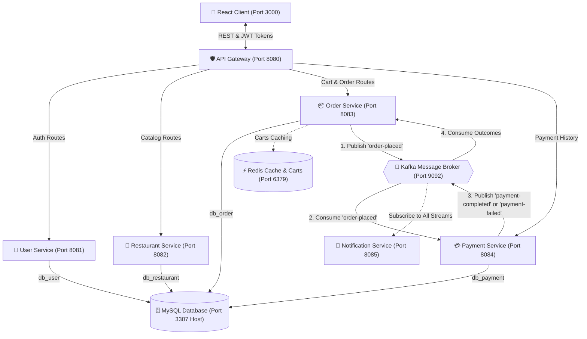

# 🍕 The Premium Food Delivery App (Microservices)

Welcome! This repository houses a **Premium Food Delivery Application** built on a modern, distributed microservices architecture. It is designed to demonstrate high-concurrency patterns, asynchronous event-driven workflows, and real-time state caching.

Below, you'll find a highly readable, human-friendly guide to how the system is put together, what every single file does, and how to get it running on your machine in minutes.

---

## 🏗️ The Big Picture (System Architecture)

Instead of one giant program, the application is divided into **6 small, specialized backend services** that talk to each other. They use **Apache Kafka** for fast, asynchronous event messaging and **Redis** for lightning-fast cart storage.

Here is a visual map showing how the pieces connect:



---

## 🛠️ The Tech Stack: Tools, Frameworks & Infrastructure
*Here are the high-performance tools powering the system behind the scenes:*

| Tool / Framework | Purpose in This Project |
| :--- | :--- |
| **☕ Spring Boot 3.3** | Serves as the foundation for all 6 microservices, handling REST controllers, JPA mappings, and transaction boundaries. |
| **🛡️ Spring Cloud Gateway** | Operates as our single-entry API Gateway, routing external traffic securely to downstream endpoints and managing CORS policies. |
| **🐳 Docker & Compose** | Standardizes and orchestrates the entire multi-service container network (microservices, brokers, and databases) with a single command. |
| **🚀 Apache Kafka** | Powers the core event-driven backbone of our system, enabling services like `OrderService` and `PaymentService` to publish/consume events asynchronously. |
| **⚡ Redis Cache** | Volatile, in-memory store utilized for managing and caching customer shopping carts on the fly with sub-millisecond latencies. |
| **🗄️ MySQL 8.0** | Reliable relational database housing persistent user accounts, dining room catalogs, payment receipts, and historical order details. |
| **📦 Apache Maven** | Handles dependency resolution, project compilation configurations, and packaging rules for the entire Java backend. |
| **🎨 React 18 + Vite** | Powers our responsive frontend dashboard. Vite compiles code instantly, while React maps dynamic views based on reactive status loops. |
| **🧠 Redux Toolkit** | Centralizes client state management, ensuring synchronized cart counts and authentication credentials across the entire client lifecycle. |
| **🌀 TailwindCSS** | High-utility styling framework enabling our modern, glassmorphic UI cards and dark mode layouts. |

---

## 📝 Languages Used & Their Roles
*This project is built using a combination of programming languages, query languages, and data serialization syntaxes:*

- **☕ Java (JDK 21/25)**: *Backend Core.* Writes the strong-typed business domain rules, transaction systems, Kafka event producers/consumers, and security configurations across all backend services.
- **🎨 JavaScript (ES6+ / React)**: *Frontend Interactive Core.* Builds the interactive dashboard UI, manages local cart stores via Redux, coordinates JWT tokens, and polls endpoints to drive order milestone animations.
- **🗄️ SQL (Structured Query Language)**: *Database Initialization.* Used in `01-init.sql` to define user database schemas and configure master database privileges.
- **📊 YAML (YAML Ain't Markup Language)**: *Service Configuration.* Powers all Spring Boot configurations (`application.yml`) and container properties (`docker-compose.yml`, Kubernetes maps).
- **📁 XML (eXtensible Markup Language)**: *Dependency Management.* Powers Maven scripts (`pom.xml`) that orchestrate compilations, Java compiler settings, and external dependency libraries.
- **🌐 HTML5 & CSS3**: *UI Structure & Styles.* HTML provides the root rendering container, while CSS implements the custom Glassmorphism styles and Tailwind animation keyframes.
- **✍️ Markdown**: *System Documentation.* Used in `README.md` to format clean, approachable system tutorials, Mermaid graphs, and file map directory indexes.

---

## 🔄 The Life of an Order (Asynchronous Journey)

What actually happens under the hood when a customer clicks **"Place Order"**? It's a fully automated, asynchronous sequence:

1. **Checkout Request**: The [React UI](file:///c:/Users/Sriraj/.gemini/antigravity-ide/scratch/food-delivery-app/frontend/src/pages/Cart.jsx) sends a checkout request via the Gateway.
2. **Order Registration**: The [Order Service](file:///c:/Users/Sriraj/.gemini/antigravity-ide/scratch/food-delivery-app/backend/order-service/src/main/java/com/food/order/service/OrderService.java) saves the order as `PLACED` in MySQL, clears the temporary cart in Redis, and publishes an `order-placed` event to Kafka.
3. **Billing Simulation**: 
   - The [Payment Service](file:///c:/Users/Sriraj/.gemini/antigravity-ide/scratch/food-delivery-app/backend/payment-service/src/main/java/com/food/payment/service/PaymentService.java) picks up the event from Kafka.
   - *Humanized Simulation Rule*: To make testing fun, if the order total is **over ₹2000.00**, it fails the payment. If it's **₹2000.00 or less**, the payment succeeds.
   - The service publishes either `payment-completed` or `payment-failed` back to Kafka.
4. **Order Confirmation & Tracker**:
   - The [Order Service](file:///c:/Users/Sriraj/.gemini/antigravity-ide/scratch/food-delivery-app/backend/order-service/src/main/java/com/food/order/messaging/PaymentConsumer.java) intercepts the billing outcome from Kafka.
   - If payment succeeded, it marks the order `CONFIRMED` and kicks off an asynchronous **Order Simulator** thread.
   - The simulator automatically updates the status every 6 seconds to reflect the kitchen progress:
     `CONFIRMED` ➔ `PREPARING` ➔ `OUT_FOR_DELIVERY` ➔ `DELIVERED`!
5. **Real-time UI Tracking**: The [React UI](file:///c:/Users/Sriraj/.gemini/antigravity-ide/scratch/food-delivery-app/frontend/src/pages/OrderTracking.jsx) polls the Order Service every 3 seconds to update the progress bar with animations.
6. **Push Notifications**: Meanwhile, the [Notification Service](file:///c:/Users/Sriraj/.gemini/antigravity-ide/scratch/food-delivery-app/backend/notification-service/src/main/java/com/food/notification/messaging/NotificationConsumer.java) listens to all events and prints stylized SMS/push messages to the terminal logs.

---

## 🛡️ Service-by-Service Architecture & Working Nodes

This section details how the services are built internally, what their responsibilities are, and how their code elements link to the others:

### 1. API Gateway (`backend/api-gateway`)
*Responsible for receiving all client traffic and routing it securely to downstream services.*
- **[ApiGatewayApplication.java](file:///c:/Users/Sriraj/.gemini/antigravity-ide/scratch/food-delivery-app/backend/api-gateway/src/main/java/com/food/gateway/ApiGatewayApplication.java)**: The main entry point bootstrapping the Netty web server.
- **[application.yml](file:///c:/Users/Sriraj/.gemini/antigravity-ide/scratch/food-delivery-app/backend/api-gateway/src/main/resources/application.yml)**: Configures gateway route definitions, enabling microservices to remain isolated while presenting a unified REST port `8080` interface to the client.

### 2. User Service (`backend/user-service`)
*Manages client accounts, roles (`CUSTOMER` and `RESTAURANT_OWNER`), and generates JWT security credentials.*
- **[SecurityConfig.java](file:///c:/Users/Sriraj/.gemini/antigravity-ide/scratch/food-delivery-app/backend/user-service/src/main/java/com/food/user/config/SecurityConfig.java)**: Secures HTTP request pathways, disables CSRF, and enforces standard password encoding.
- **[JwtAuthenticationFilter.java](file:///c:/Users/Sriraj/.gemini/antigravity-ide/scratch/food-delivery-app/backend/user-service/src/main/java/com/food/user/config/JwtAuthenticationFilter.java)** & **[JwtService.java](file:///c:/Users/Sriraj/.gemini/antigravity-ide/scratch/food-delivery-app/backend/user-service/src/main/java/com/food/user/config/JwtService.java)**: Decodes client Bearer tokens to identify authenticated sessions.
- **[UserController.java](file:///c:/Users/Sriraj/.gemini/antigravity-ide/scratch/food-delivery-app/backend/user-service/src/main/java/com/food/user/controller/UserController.java)**: Exposes endpoints for authentication (`/api/v1/auth/register`, `/api/v1/auth/login`).
- **[UserService.java](file:///c:/Users/Sriraj/.gemini/antigravity-ide/scratch/food-delivery-app/backend/user-service/src/main/java/com/food/user/service/UserService.java)**: Handles database persistence in `db_user` and validates user credentials.

### 3. Restaurant Service (`backend/restaurant-service`)
*Exposes catalogs of dining kitchens, menus, prices, and high-quality meal illustrations.*
- **[RestaurantController.java](file:///c:/Users/Sriraj/.gemini/antigravity-ide/scratch/food-delivery-app/backend/restaurant-service/src/main/java/com/food/restaurant/controller/RestaurantController.java)**: Exposes `/api/v1/restaurants` for listing kitchens and menus.
- **[RestaurantService.java](file:///c:/Users/Sriraj/.gemini/antigravity-ide/scratch/food-delivery-app/backend/restaurant-service/src/main/java/com/food/restaurant/service/RestaurantService.java)**: Connects to the `db_restaurant` schema to query lists of restaurants and individual menu structures.

### 4. Order Service (`backend/order-service`)
*Manages customer shopping carts and aggregates checkout processing.*
- **[CartController.java](file:///c:/Users/Sriraj/.gemini/antigravity-ide/scratch/food-delivery-app/backend/order-service/src/main/java/com/food/order/controller/CartController.java)** & **[CartService.java](file:///c:/Users/Sriraj/.gemini/antigravity-ide/scratch/food-delivery-app/backend/order-service/src/main/java/com/food/order/service/CartService.java)**: Reads and writes active customer carts directly into **Redis** cache clusters for ultra-fast, volatile storage.
- **[OrderController.java](file:///c:/Users/Sriraj/.gemini/antigravity-ide/scratch/food-delivery-app/backend/order-service/src/main/java/com/food/order/controller/OrderController.java)**: Exposes endpoints to trigger order checkout (`/api/v1/orders/checkout`), retrieve order histories, and manually adjust status codes.
- **[OrderService.java](file:///c:/Users/Sriraj/.gemini/antigravity-ide/scratch/food-delivery-app/backend/order-service/src/main/java/com/food/order/service/OrderService.java)**: Validates carts, calculates order discount aggregates, saves order records to `db_order`, and publishes order events to Kafka.
- **[OrderProducer.java](file:///c:/Users/Sriraj/.gemini/antigravity-ide/scratch/food-delivery-app/backend/order-service/src/main/java/com/food/order/messaging/OrderProducer.java)**: Broadcasts serialized events (`order-placed`, `order-status-updated`) to Apache Kafka queues.
- **[PaymentConsumer.java](file:///c:/Users/Sriraj/.gemini/antigravity-ide/scratch/food-delivery-app/backend/order-service/src/main/java/com/food/order/messaging/PaymentConsumer.java)**: Subscribes to `payment-completed` and `payment-failed` topics. Upon successful payments, it changes the order status to `CONFIRMED`, triggering the driver simulation.
- **[OrderSimulator.java](file:///c:/Users/Sriraj/.gemini/antigravity-ide/scratch/food-delivery-app/backend/order-service/src/main/java/com/food/order/service/OrderSimulator.java)**: Asynchronously updates order milestones after payment confirmation (`CONFIRMED` ➔ `PREPARING` ➔ `OUT_FOR_DELIVERY` ➔ `DELIVERED`).

### 5. Payment Service (`backend/payment-service`)
*Simulates billing authentication cycles.*
- **[OrderConsumer.java](file:///c:/Users/Sriraj/.gemini/antigravity-ide/scratch/food-delivery-app/backend/payment-service/src/main/java/com/food/payment/messaging/OrderConsumer.java)**: Subscribes to Kafka's `order-placed` stream and triggers immediate payment simulation.
- **[PaymentService.java](file:///c:/Users/Sriraj/.gemini/antigravity-ide/scratch/food-delivery-app/backend/payment-service/src/main/java/com/food/payment/service/PaymentService.java)**: Analyzes the billing total:
  - **Simulation rule**: Any checkout total exceeding **₹2000.00** automatically triggers a failed transaction simulation (`PaymentStatus.FAILED`) to demonstrate system diversity.
  - Charges **₹2000.00 or lower** are marked as successful (`PaymentStatus.SUCCESS`).
- **[PaymentProducer.java](file:///c:/Users/Sriraj/.gemini/antigravity-ide/scratch/food-delivery-app/backend/payment-service/src/main/java/com/food/payment/messaging/PaymentProducer.java)**: Publishes verified billing events onto the `payment-completed` or `payment-failed` Kafka streams.

### 6. Notification Service (`backend/notification-service`)
*Provides automated user message alerts.*
- **[NotificationConsumer.java](file:///c:/Users/Sriraj/.gemini/antigravity-ide/scratch/food-delivery-app/backend/notification-service/src/main/java/com/food/notification/messaging/NotificationConsumer.java)**: Acts as a multi-topic listener, capturing events across `order-placed`, `payment-completed`, `payment-failed`, and `order-status-updated` topics to output beautiful push alerts directly into system logs.

---

## 🗂️ The Developer's Map: Every File Explained Simply

To help you find your way around, here is a clean, human-readable breakdown of every file in this workspace.

### 📁 Root & Orchestration Files
- **[.gitignore](file:///c:/Users/Sriraj/.gemini/antigravity-ide/scratch/food-delivery-app/.gitignore)**: Keeps the repo clean by ignoring temporary build directories (`target/`, `dist/`), IDE settings, and `node_modules/`.
- **[docker-compose.yml](file:///c:/Users/Sriraj/.gemini/antigravity-ide/scratch/food-delivery-app/docker/docker-compose.yml)**: The master recipe that spins up all databases, middleware, and microservices in Docker with correct networking, environment variables, and volumes.
- **[01-init.sql](file:///c:/Users/Sriraj/.gemini/antigravity-ide/scratch/food-delivery-app/docker/init-scripts/01-init.sql)**: Automatically creates the four database schemas (`db_user`, `db_restaurant`, `db_order`, `db_payment`) inside MySQL on startup and sets up root user privileges.
- **[pom.xml (Root)](file:///c:/Users/Sriraj/.gemini/antigravity-ide/scratch/food-delivery-app/backend/pom.xml)**: The parent Maven build file. Centralizes dependency versions (Spring Boot, Spring Cloud, Lombok) so that all Java services stay in sync.

---

### 🛡️ 1. API Gateway (`backend/api-gateway/`)
*The entry point. Receives all frontend requests and routes them to the right backend microservice.*
- **[pom.xml](file:///c:/Users/Sriraj/.gemini/antigravity-ide/scratch/food-delivery-app/backend/api-gateway/pom.xml)**: Downloads Gateway and Routing dependencies.
- **[Dockerfile](file:///c:/Users/Sriraj/.gemini/antigravity-ide/scratch/food-delivery-app/backend/api-gateway/Dockerfile)**: Packages the gateway jar into a container running on port `8080`.
- **[ApiGatewayApplication.java](file:///c:/Users/Sriraj/.gemini/antigravity-ide/scratch/food-delivery-app/backend/api-gateway/src/main/java/com/food/gateway/ApiGatewayApplication.java)**: Launches the service.
- **[application.yml](file:///c:/Users/Sriraj/.gemini/antigravity-ide/scratch/food-delivery-app/backend/api-gateway/src/main/resources/application.yml)**: Sets up CORS access and maps URL paths to the matching microservice.

---

### 👤 2. User Service (`backend/user-service/`)
*Manages registration, logins, passwords, and issues security tokens (JWT).*
- **[pom.xml](file:///c:/Users/Sriraj/.gemini/antigravity-ide/scratch/food-delivery-app/backend/user-service/pom.xml)**: Links Spring Security, JWT, MySQL, and database connectors.
- **[Dockerfile](file:///c:/Users/Sriraj/.gemini/antigravity-ide/scratch/food-delivery-app/backend/user-service/Dockerfile)**: Configures container setup on port `8081`.
- **[UserServiceApplication.java](file:///c:/Users/Sriraj/.gemini/antigravity-ide/scratch/food-delivery-app/backend/user-service/src/main/java/com/food/user/UserServiceApplication.java)**: Launches the service.
- **[SecurityConfig.java](file:///c:/Users/Sriraj/.gemini/antigravity-ide/scratch/food-delivery-app/backend/user-service/src/main/java/com/food/user/config/SecurityConfig.java)**: Enforces application security policies, sets up password hashing, and configures route permissions.
- **[JwtService.java](file:///c:/Users/Sriraj/.gemini/antigravity-ide/scratch/food-delivery-app/backend/user-service/src/main/java/com/food/user/config/JwtService.java)**: Generates new JWT strings, signs them securely, and parses them to read username/claims.
- **[JwtAuthenticationFilter.java](file:///c:/Users/Sriraj/.gemini/antigravity-ide/scratch/food-delivery-app/backend/user-service/src/main/java/com/food/user/config/JwtAuthenticationFilter.java)**: Intercepts all incoming API calls, checks for a `Bearer` token in the header, and registers the session if valid.
- **[UserController.java](file:///c:/Users/Sriraj/.gemini/antigravity-ide/scratch/food-delivery-app/backend/user-service/src/main/java/com/food/user/controller/UserController.java)**: Exposes routes for registering (`/api/v1/auth/register`) and logging in (`/api/v1/auth/login`).
- **[AuthResponse.java](file:///c:/Users/Sriraj/.gemini/antigravity-ide/scratch/food-delivery-app/backend/user-service/src/main/java/com/food/user/dto/AuthResponse.java)**: DTO that returns the logged-in user profile alongside their JWT token.
- **[LoginRequest.java](file:///c:/Users/Sriraj/.gemini/antigravity-ide/scratch/food-delivery-app/backend/user-service/src/main/java/com/food/user/dto/LoginRequest.java)**: Holds user email and password inputs during authentication.
- **[RegisterRequest.java](file:///c:/Users/Sriraj/.gemini/antigravity-ide/scratch/food-delivery-app/backend/user-service/src/main/java/com/food/user/dto/RegisterRequest.java)**: Holds registration details (name, email, role, etc.).
- **[UserDto.java](file:///c:/Users/Sriraj/.gemini/antigravity-ide/scratch/food-delivery-app/backend/user-service/src/main/java/com/food/user/dto/UserDto.java)**: Data representation of a user profile passed to the client.
- **[GlobalExceptionHandler.java](file:///c:/Users/Sriraj/.gemini/antigravity-ide/scratch/food-delivery-app/backend/user-service/src/main/java/com/food/user/exception/GlobalExceptionHandler.java)**: Catches errors throughout the service and sends clean, readable messages to the client.
- **[Role.java](file:///c:/Users/Sriraj/.gemini/antigravity-ide/scratch/food-delivery-app/backend/user-service/src/main/java/com/food/user/model/Role.java)**: Simple user role enum (`CUSTOMER` / `RESTAURANT_OWNER`).
- **[User.java](file:///c:/Users/Sriraj/.gemini/antigravity-ide/scratch/food-delivery-app/backend/user-service/src/main/java/com/food/user/model/User.java)**: The database schema model for user accounts.
- **[UserRepository.java](file:///c:/Users/Sriraj/.gemini/antigravity-ide/scratch/food-delivery-app/backend/user-service/src/main/java/com/food/user/repository/UserRepository.java)**: Database query interface to manage user records.
- **[UserService.java](file:///c:/Users/Sriraj/.gemini/antigravity-ide/scratch/food-delivery-app/backend/user-service/src/main/java/com/food/user/service/UserService.java)**: Implements password encoding, new account logic, and authentication validation.
- **[application.yml](file:///c:/Users/Sriraj/.gemini/antigravity-ide/scratch/food-delivery-app/backend/user-service/src/main/resources/application.yml)**: Connects the service to the `db_user` database schema and sets secret keys.

---

### 🍳 3. Restaurant Service (`backend/restaurant-service/`)
*Serves up the catalog of kitchens, menus, pricing, and yummy dish images.*
- **[pom.xml](file:///c:/Users/Sriraj/.gemini/antigravity-ide/scratch/food-delivery-app/backend/restaurant-service/pom.xml)**: Links core web, database, and Lombok tools.
- **[Dockerfile](file:///c:/Users/Sriraj/.gemini/antigravity-ide/scratch/food-delivery-app/backend/restaurant-service/Dockerfile)**: Configures container setup on port `8082`.
- **[RestaurantServiceApplication.java](file:///c:/Users/Sriraj/.gemini/antigravity-ide/scratch/food-delivery-app/backend/restaurant-service/src/main/java/com/food/restaurant/RestaurantServiceApplication.java)**: Launches the service.
- **[RestaurantController.java](file:///c:/Users/Sriraj/.gemini/antigravity-ide/scratch/food-delivery-app/backend/restaurant-service/src/main/java/com/food/restaurant/controller/RestaurantController.java)**: REST endpoints exposing public lists of restaurants, detailed menu indexes, and single item queries.
- **[MenuItemDto.java](file:///c:/Users/Sriraj/.gemini/antigravity-ide/scratch/food-delivery-app/backend/restaurant-service/src/main/java/com/food/restaurant/dto/MenuItemDto.java)** & **[RestaurantDto.java](file:///c:/Users/Sriraj/.gemini/antigravity-ide/scratch/food-delivery-app/backend/restaurant-service/src/main/java/com/food/restaurant/dto/RestaurantDto.java)**: Simple objects mapping restaurant and menu item data back to client components cleanly.
- **[GlobalExceptionHandler.java](file:///c:/Users/Sriraj/.gemini/antigravity-ide/scratch/food-delivery-app/backend/restaurant-service/src/main/java/com/food/restaurant/exception/GlobalExceptionHandler.java)**: Handles database query errors and missing record alerts smoothly.
- **[MenuItem.java](file:///c:/Users/Sriraj/.gemini/antigravity-ide/scratch/food-delivery-app/backend/restaurant-service/src/main/java/com/food/restaurant/model/MenuItem.java)** & **[Restaurant.java](file:///c:/Users/Sriraj/.gemini/antigravity-ide/scratch/food-delivery-app/backend/restaurant-service/src/main/java/com/food/restaurant/model/Restaurant.java)**: The database schema models representing cuisines, menus, ratings, pricing, and images.
- **[MenuItemRepository.java](file:///c:/Users/Sriraj/.gemini/antigravity-ide/scratch/food-delivery-app/backend/restaurant-service/src/main/java/com/food/restaurant/repository/MenuItemRepository.java)** & **[RestaurantRepository.java](file:///c:/Users/Sriraj/.gemini/antigravity-ide/scratch/food-delivery-app/backend/restaurant-service/src/main/java/com/food/restaurant/repository/RestaurantRepository.java)**: JPA interfaces querying kitchen items inside MySQL.
- **[RestaurantService.java](file:///c:/Users/Sriraj/.gemini/antigravity-ide/scratch/food-delivery-app/backend/restaurant-service/src/main/java/com/food/restaurant/service/RestaurantService.java)**: Business logic fetching dining information from `db_restaurant`.
- **[application.yml](file:///c:/Users/Sriraj/.gemini/antigravity-ide/scratch/food-delivery-app/backend/restaurant-service/src/main/resources/application.yml)**: Connects to MySQL configurations.

---

### 📦 4. Order Service (`backend/order-service/`)
*The orchestrator. Handles live carts (cached in Redis), checkout flows, and simulates live delivery trackers.*
- **[pom.xml](file:///c:/Users/Sriraj/.gemini/antigravity-ide/scratch/food-delivery-app/backend/order-service/pom.xml)**: Imports JPA, Redis drivers, and Kafka messaging systems.
- **[Dockerfile](file:///c:/Users/Sriraj/.gemini/antigravity-ide/scratch/food-delivery-app/backend/order-service/Dockerfile)**: Configures container setup on port `8083`.
- **[OrderServiceApplication.java](file:///c:/Users/Sriraj/.gemini/antigravity-ide/scratch/food-delivery-app/backend/order-service/src/main/java/com/food/order/OrderServiceApplication.java)**: Launches the service.
- **[KafkaConfig.java](file:///c:/Users/Sriraj/.gemini/antigravity-ide/scratch/food-delivery-app/backend/order-service/src/main/java/com/food/order/config/KafkaConfig.java)**: Configures Kafka deserializers and message listeners to receive updates, and templates to publish events.
- **[RedisConfig.java](file:///c:/Users/Sriraj/.gemini/antigravity-ide/scratch/food-delivery-app/backend/order-service/src/main/java/com/food/order/config/RedisConfig.java)**: Connects to Redis caching nodes to save user shopping carts.
- **[CartController.java](file:///c:/Users/Sriraj/.gemini/antigravity-ide/scratch/food-delivery-app/backend/order-service/src/main/java/com/food/order/controller/CartController.java)**: Exposes routes to add items to cart, query cart state, and clear active selections.
- **[OrderController.java](file:///c:/Users/Sriraj/.gemini/antigravity-ide/scratch/food-delivery-app/backend/order-service/src/main/java/com/food/order/controller/OrderController.java)**: Handles order checkouts (`/api/v1/orders/checkout`) and fetches history logs.
- **[CartDto.java](file:///c:/Users/Sriraj/.gemini/antigravity-ide/scratch/food-delivery-app/backend/order-service/src/main/java/com/food/order/dto/CartDto.java)**: Maps cached cart models from Redis back to client views.
- **[CreateOrderRequest.java](file:///c:/Users/Sriraj/.gemini/antigravity-ide/scratch/food-delivery-app/backend/order-service/src/main/java/com/food/order/dto/CreateOrderRequest.java)**: Input DTO carrying discount coupon calculations and shipping addresses during checkout.
- **[OrderDto.java](file:///c:/Users/Sriraj/.gemini/antigravity-ide/scratch/food-delivery-app/backend/order-service/src/main/java/com/food/order/dto/OrderDto.java)**: Maps output order states and nested items.
- **[GlobalExceptionHandler.java](file:///c:/Users/Sriraj/.gemini/antigravity-ide/scratch/food-delivery-app/backend/order-service/src/main/java/com/food/order/exception/GlobalExceptionHandler.java)**: Manages invalid checkout actions and prints clean error payloads.
- **[OrderProducer.java](file:///c:/Users/Sriraj/.gemini/antigravity-ide/scratch/food-delivery-app/backend/order-service/src/main/java/com/food/order/messaging/OrderProducer.java)**: Broadcasts serialized checkout messages onto Kafka topics.
- **[PaymentConsumer.java](file:///c:/Users/Sriraj/.gemini/antigravity-ide/scratch/food-delivery-app/backend/order-service/src/main/java/com/food/order/messaging/PaymentConsumer.java)**: Consumes billing events. On payment success, it flags orders `CONFIRMED` and triggers the live kitchen simulator.
- **[Cart.java](file:///c:/Users/Sriraj/.gemini/antigravity-ide/scratch/food-delivery-app/backend/order-service/src/main/java/com/food/order/model/Cart.java)** & **[CartItem.java](file:///c:/Users/Sriraj/.gemini/antigravity-ide/scratch/food-delivery-app/backend/order-service/src/main/java/com/food/order/model/CartItem.java)**: Serialized models saved inside Redis caches representing cart states.
- **[Order.java](file:///c:/Users/Sriraj/.gemini/antigravity-ide/scratch/food-delivery-app/backend/order-service/src/main/java/com/food/order/model/Order.java)** & **[OrderItem.java](file:///c:/Users/Sriraj/.gemini/antigravity-ide/scratch/food-delivery-app/backend/order-service/src/main/java/com/food/order/model/OrderItem.java)**: The main JPA database tables saved under the `db_order` schema.
- **[OrderStatus.java](file:///c:/Users/Sriraj/.gemini/antigravity-ide/scratch/food-delivery-app/backend/order-service/src/main/java/com/food/order/model/OrderStatus.java)**: Tracking milestone Enum (`PLACED`, `CONFIRMED`, `PREPARING`, `OUT_FOR_DELIVERY`, `DELIVERED`, `CANCELLED`, `PAYMENT_FAILED`).
- **[OrderRepository.java](file:///c:/Users/Sriraj/.gemini/antigravity-ide/scratch/food-delivery-app/backend/order-service/src/main/java/com/food/order/repository/OrderRepository.java)**: JPA DB layer interface for managing order schemas.
- **[CartService.java](file:///c:/Users/Sriraj/.gemini/antigravity-ide/scratch/food-delivery-app/backend/order-service/src/main/java/com/food/order/service/CartService.java)**: Real-time service layer reading and clearing cached cards in Redis.
- **[OrderService.java](file:///c:/Users/Sriraj/.gemini/antigravity-ide/scratch/food-delivery-app/backend/order-service/src/main/java/com/food/order/service/OrderService.java)**: Core service processing checkout pipelines, applying discounts, saving tables, and dispatching Kafka signals.
- **[OrderSimulator.java](file:///c:/Users/Sriraj/.gemini/antigravity-ide/scratch/food-delivery-app/backend/order-service/src/main/java/com/food/order/service/OrderSimulator.java)**: Drives the asynchronous order milestone engine, updating the status every 6 seconds to simulate real restaurant/delivery operations.
- **[application.yml](file:///c:/Users/Sriraj/.gemini/antigravity-ide/scratch/food-delivery-app/backend/order-service/src/main/resources/application.yml)**: Connects database schemes (`db_order`), Redis caches, and Kafka brokers.

---

### 💳 5. Payment Service (`backend/payment-service/`)
*Simulates billing approvals. Processes transaction simulations based on checkout amounts.*
- **[pom.xml](file:///c:/Users/Sriraj/.gemini/antigravity-ide/scratch/food-delivery-app/backend/payment-service/pom.xml)**: links standard database, Lombok, and Kafka messaging systems.
- **[Dockerfile](file:///c:/Users/Sriraj/.gemini/antigravity-ide/scratch/food-delivery-app/backend/payment-service/Dockerfile)**: Configures container setup on port `8084`.
- **[PaymentServiceApplication.java](file:///c:/Users/Sriraj/.gemini/antigravity-ide/scratch/food-delivery-app/backend/payment-service/src/main/java/com/food/payment/PaymentServiceApplication.java)**: Launches the service.
- **[KafkaConfig.java](file:///c:/Users/Sriraj/.gemini/antigravity-ide/scratch/food-delivery-app/backend/payment-service/src/main/java/com/food/payment/config/KafkaConfig.java)**: Configures Kafka deserializers and message listeners.
- **[PaymentController.java](file:///c:/Users/Sriraj/.gemini/antigravity-ide/scratch/food-delivery-app/backend/payment-service/src/main/java/com/food/payment/controller/PaymentController.java)**: REST endpoints looking up historical transactions by order references (`/api/v1/payments/order/{orderId}`).
- **[PaymentDto.java](file:///c:/Users/Sriraj/.gemini/antigravity-ide/scratch/food-delivery-app/backend/payment-service/src/main/java/com/food/payment/dto/PaymentDto.java)**: Billing mapping transfer object.
- **[OrderConsumer.java](file:///c:/Users/Sriraj/.gemini/antigravity-ide/scratch/food-delivery-app/backend/payment-service/src/main/java/com/food/payment/messaging/OrderConsumer.java)**: Subscribes to the Kafka topic `order-placed` to capture checkouts and triggers billing verification.
- **[PaymentProducer.java](file:///c:/Users/Sriraj/.gemini/antigravity-ide/scratch/food-delivery-app/backend/payment-service/src/main/java/com/food/payment/messaging/PaymentProducer.java)**: Publishes payment outcomes to Kafka (`payment-completed` or `payment-failed`).
- **[Payment.java](file:///c:/Users/Sriraj/.gemini/antigravity-ide/scratch/food-delivery-app/backend/payment-service/src/main/java/com/food/payment/model/Payment.java)**: Relational JPA table entity mapped to the `db_payment` database schema.
- **[PaymentStatus.java](file:///c:/Users/Sriraj/.gemini/antigravity-ide/scratch/food-delivery-app/backend/payment-service/src/main/java/com/food/payment/model/PaymentStatus.java)**: Simple billing outcomes enum (`SUCCESS` / `FAILED`).
- **[PaymentRepository.java](file:///c:/Users/Sriraj/.gemini/antigravity-ide/scratch/food-delivery-app/backend/payment-service/src/main/java/com/food/payment/repository/PaymentRepository.java)**: Database interface exposing JPA query actions for Payment records.
- **[PaymentService.java](file:///c:/Users/Sriraj/.gemini/antigravity-ide/scratch/food-delivery-app/backend/payment-service/src/main/java/com/food/payment/service/PaymentService.java)**: Processes payments. Implements the business rule to fail charges exceeding **₹2000.00** to simulate transaction variety.
- **[application.yml](file:///c:/Users/Sriraj/.gemini/antigravity-ide/scratch/food-delivery-app/backend/payment-service/src/main/resources/application.yml)**: Links service databases and Kafka configuration parameters.

---

### 🔔 6. Notification Service (`backend/notification-service/`)
*Listens to the event pipeline and prints beautiful system logs to simulate SMS and push notifications.*
- **[pom.xml](file:///c:/Users/Sriraj/.gemini/antigravity-ide/scratch/food-delivery-app/backend/notification-service/pom.xml)**: Standard web and Kafka libraries.
- **[Dockerfile](file:///c:/Users/Sriraj/.gemini/antigravity-ide/scratch/food-delivery-app/backend/notification-service/Dockerfile)**: Configures container setup on port `8085`.
- **[NotificationServiceApplication.java](file:///c:/Users/Sriraj/.gemini/antigravity-ide/scratch/food-delivery-app/backend/notification-service/src/main/java/com/food/notification/NotificationServiceApplication.java)**: Launches the service.
- **[KafkaConfig.java](file:///c:/Users/Sriraj/.gemini/antigravity-ide/scratch/food-delivery-app/backend/notification-service/src/main/java/com/food/notification/config/KafkaConfig.java)**: Bootstraps Kafka configuration parameters.
- **[NotificationConsumer.java](file:///c:/Users/Sriraj/.gemini/antigravity-ide/scratch/food-delivery-app/backend/notification-service/src/main/java/com/food/notification/messaging/NotificationConsumer.java)**: Subscribes to all event channels on Kafka and outputs formatted, stylized alert messages in the console logs.
- **[application.yml](file:///c:/Users/Sriraj/.gemini/antigravity-ide/scratch/food-delivery-app/backend/notification-service/src/main/resources/application.yml)**: Links to Kafka message brokers.

---

### 🎨 7. React Frontend Application (`frontend/`)
*A responsive, modern UI styled with dark glassmorphism.*
- **[index.html](file:///c:/Users/Sriraj/.gemini/antigravity-ide/scratch/food-delivery-app/frontend/index.html)**: The container webpage mounting the app's script bundle.
- **[package.json](file:///c:/Users/Sriraj/.gemini/antigravity-ide/scratch/food-delivery-app/frontend/package.json)** & **[package-lock.json](file:///c:/Users/Sriraj/.gemini/antigravity-ide/scratch/food-delivery-app/frontend/package-lock.json)**: Declares all third-party layout dependencies (Lucide Icons, Redux, React Router, Vite).
- **[postcss.config.js](file:///c:/Users/Sriraj/.gemini/antigravity-ide/scratch/food-delivery-app/frontend/postcss.config.js)** & **[tailwind.config.js](file:///c:/Users/Sriraj/.gemini/antigravity-ide/scratch/food-delivery-app/frontend/tailwind.config.js)**: Configures dynamic CSS stylesheets layout utilities.
- **[vite.config.js](file:///c:/Users/Sriraj/.gemini/antigravity-ide/scratch/food-delivery-app/frontend/vite.config.js)**: Sets up the development server on Port `3000`.
- **📁 [public/](file:///c:/Users/Sriraj/.gemini/antigravity-ide/scratch/food-delivery-app/frontend/public)**: Contains high-quality, pre-compiled static assets and food illustrations.
- **[main.jsx](file:///c:/Users/Sriraj/.gemini/antigravity-ide/scratch/food-delivery-app/frontend/src/main.jsx)**: The React core mounting script.
- **[index.css](file:///c:/Users/Sriraj/.gemini/antigravity-ide/scratch/food-delivery-app/frontend/src/index.css)**: Implements custom global design overrides, harmonized HSL color tokens, and custom Glassmorphic styles.
- **[App.jsx](file:///c:/Users/Sriraj/.gemini/antigravity-ide/scratch/food-delivery-app/frontend/src/App.jsx)**: Establishes routes linking page views.
- **[Navbar.jsx](file:///c:/Users/Sriraj/.gemini/antigravity-ide/scratch/food-delivery-app/frontend/src/components/Navbar.jsx)**: A sticky header showing login state and live cart items count.
- **[ProtectedRoute.jsx](file:///c:/Users/Sriraj/.gemini/antigravity-ide/scratch/food-delivery-app/frontend/src/components/ProtectedRoute.jsx)**: Intercepts navigation requests, enforcing active JWT sessions and correct roles before showing pages.
- **[api.js](file:///c:/Users/Sriraj/.gemini/antigravity-ide/scratch/food-delivery-app/frontend/src/services/api.js)**: Configures our central Axios client and automatically injects JWT Bearer tokens into request headers.
- **[index.js (Store)](file:///c:/Users/Sriraj/.gemini/antigravity-ide/scratch/food-delivery-app/frontend/src/store/index.js)**: Connects auth and cart state controllers.
- **[authSlice.js](file:///c:/Users/Sriraj/.gemini/antigravity-ide/scratch/food-delivery-app/frontend/src/store/authSlice.js)**: Redux slice managing active customer identities.
- **[cartSlice.js](file:///c:/Users/Sriraj/.gemini/antigravity-ide/scratch/food-delivery-app/frontend/src/store/cartSlice.js)**: Redux slice managing selected dishes, adding counts, and executing coupon codes.
- **[Login.jsx](file:///c:/Users/Sriraj/.gemini/antigravity-ide/scratch/food-delivery-app/frontend/src/pages/Login.jsx)** & **[Register.jsx](file:///c:/Users/Sriraj/.gemini/antigravity-ide/scratch/food-delivery-app/frontend/src/pages/Register.jsx)**: Authenticates client credentials against backend identity endpoints.
- **[RestaurantBrowse.jsx](file:///c:/Users/Sriraj/.gemini/antigravity-ide/scratch/food-delivery-app/frontend/src/pages/RestaurantBrowse.jsx)**: Home catalog dashboard rendering kitchens, ratings, and cuisines.
- **[RestaurantDetails.jsx](file:///c:/Users/Sriraj/.gemini/antigravity-ide/scratch/food-delivery-app/frontend/src/pages/RestaurantDetails.jsx)**: Renders a single kitchen's menu and lets users add dishes to their cart.
- **[Cart.jsx](file:///c:/Users/Sriraj/.gemini/antigravity-ide/scratch/food-delivery-app/frontend/src/pages/Cart.jsx)**: Manages items checkout, addresses, and discount aggregates.
- **[OrderHistory.jsx](file:///c:/Users/Sriraj/.gemini/antigravity-ide/scratch/food-delivery-app/frontend/src/pages/OrderHistory.jsx)**: Lists custom logs of historical orders alongside progress trackers.
- **[OrderTracking.jsx](file:///c:/Users/Sriraj/.gemini/antigravity-ide/scratch/food-delivery-app/frontend/src/pages/OrderTracking.jsx)**: Real-time progress panel, rendering micro-animations mapping preparing and driver delivery states.
- **[AdminDashboard.jsx](file:///c:/Users/Sriraj/.gemini/antigravity-ide/scratch/food-delivery-app/frontend/src/pages/AdminDashboard.jsx)**: Reserved administration dashboard view for users with the `RESTAURANT_OWNER` role.

---

### 📁 Kubernetes Cluster Maps (`k8s/`)
*Exposes standard cluster mappings to deploy this app in Kubernetes.*
- Includes individual deployment configs (`*-deployment.yaml`) for each backend microservice, Redis, and Kafka.

---

## 🔍 Micro-Engineering Details: API, Kafka, DB & Redis Specs

For developers digging deep, here are the exact structural specifications powering the application layers:

### 1. Unified REST API Endpoints

All external queries land on the **API Gateway (Port 8080)** and are securely routed to downstream services:

| Service | HTTP Method | Endpoint | Request Payload | Response / Output |
| :--- | :--- | :--- | :--- | :--- |
| **User Service** | `POST` | `/api/v1/auth/register` | `RegisterRequest` (JSON) | `AuthResponse` + JWT String |
| **User Service** | `POST` | `/api/v1/auth/login` | `LoginRequest` (JSON) | `AuthResponse` + JWT String |
| **Restaurant** | `GET` | `/api/v1/restaurants` | None | `List<RestaurantDto>` (JSON) |
| **Restaurant** | `GET` | `/api/v1/restaurants/{id}` | None | `RestaurantDto` including Menus |
| **Order Service**| `GET` | `/api/v1/cart/{customerId}`| None | `CartDto` active items in Redis |
| **Order Service**| `POST` | `/api/v1/cart/{customerId}/add`| `CartItemDto` + queries | Updated `CartDto` |
| **Order Service**| `POST` | `/api/v1/orders/checkout` | `CreateOrderRequest` | Newly persistent `OrderDto` |
| **Order Service**| `GET` | `/api/v1/orders/customer/{id}`| None | List of past `OrderDto` items |
| **Order Service**| `GET` | `/api/v1/orders/{orderId}` | None | Detailed `OrderDto` tracking nodes |
| **Payment Service**| `GET` | `/api/v1/payments/order/{orderId}`| None | `PaymentDto` transaction logs |

---

### 2. Kafka Messaging Streams & Group Mappings

The asynchronous backbone utilizes the following event definitions:

- **Bootstrap Server**: `localhost:9092` (defined as `kafka` inside Docker Bridge network)
- **Serialization**: String Keys & JSON Stringified Values.

| Topic Name | Event Publisher | Event Subscriber(s) | Group ID | Purpose |
| :--- | :--- | :--- | :--- | :--- |
| `order-placed` | `Order Service` | `Payment Service`<br>`Notification Service` | `payment-group`<br>`notification-group` | Alerts the payment engine that checkout succeeded and prints user push confirmations. |
| `payment-completed`| `Payment Service` | `Order Service`<br>`Notification Service` | `order-group`<br>`notification-group` | Signals successful transaction; transitions Order to `CONFIRMED` and starts driver tracking. |
| `payment-failed` | `Payment Service` | `Order Service`<br>`Notification Service` | `order-group`<br>`notification-group` | Signals transaction failure; flags Order as `PAYMENT_FAILED` and triggers a cancellation alert. |
| `order-status-updated`| `Order Service` | `Notification Service` | `notification-group` | Broadcasts delivery simulator updates (`PREPARING`, `OUT_FOR_DELIVERY`, `DELIVERED`). |

---

### 3. Caching & Database Schema Structures

#### ⚡ Redis Cart Structures
Carts are volatile structures cached under the prefix **`cart::<customerId>`** (e.g., `cart::1`).
- **Data Shape**:
  ```json
  {
    "customerId": 1,
    "restaurantId": 2,
    "restaurantName": "Indian Kitchen",
    "items": [
      {
        "menuItemId": 5,
        "name": "Butter Chicken",
        "price": 380.00,
        "quantity": 2
      }
    ]
  }
  ```

#### 🗄️ Relational MySQL Tables
Four distinct databases are run inside the Docker engine:
1. **`db_user`**
   - **`users` Table**: `id` (PK, AUTO_INC), `name`, `email` (UNIQUE), `password` (BCrypt Hash), `role` (`CUSTOMER` / `RESTAURANT_OWNER`).
2. **`db_restaurant`**
   - **`restaurants` Table**: `id` (PK), `name`, `cuisine_type`, `rating`, `cover_image`.
   - **`menu_items` Table**: `id` (PK), `restaurant_id` (FK), `name`, `price`, `image_url`.
3. **`db_order`**
   - **`orders` Table**: `id` (PK, AUTO_INC), `customer_id`, `restaurant_id`, `restaurant_name`, `total_amount`, `status` (Enum), `delivery_address`, `created_at`.
   - **`order_items` Table**: `id` (PK), `order_id` (FK), `menu_item_id`, `name`, `price`, `quantity`.
4. **`db_payment`**
   - **`payments` Table**: `id` (PK, AUTO_INC), `order_id`, `customer_id`, `amount`, `status` (Enum), `transaction_id`, `processed_at`.

---

### 4. Security Protocols (BCrypt & JWT)
- **Password Encryption**: Handled via `BCryptPasswordEncoder` in `user-service`. Passwords are salted and hashed prior to being written to `db_user.users`.
- **JSON Web Tokens**:
  - Encoded with `SignatureAlgorithm.HS256`.
  - **Payload Claims**:
    ```json
    {
      "sub": "sriraj@example.com",
      "iat": 1782658400,
      "exp": 1782744800,
      "role": "CUSTOMER"
    }
    ```

---

## ⚡ Quick Start: Get the App Running

### 🐳 Prerequisites
Make sure you have [Docker Desktop](https://www.docker.com/products/docker-desktop/) running on your system.

### Step 1: Boot the Backend Cluster
From the root workspace folder, navigate to the docker configurations and boot up the microservices network:
```powershell
cd docker
docker compose up -d --build
```
> **MySQL Port Mapping**: The database maps to port **`3307`** externally on your host machine to prevent conflicts with any local MySQL service running on your computer.

Check that all 10 containers are active:
```powershell
docker compose ps
```

### Step 2: Spin up the React Frontend App
Open a separate terminal window, navigate to the frontend folder, and launch the Vite development server:
```powershell
cd frontend
npm.cmd run dev
```

### Step 3: Open and Play!
Navigate to: **[http://localhost:3000/](http://localhost:3000/)** in your browser!

**💡 Recommended Walkthrough Flow**:
1. **Register** a new customer account.
2. **Browse** the available kitchens and add some delicious meals to your cart.
3. Open your **Cart**, check out, and head over to the **Order Tracking** screen!
4. Watch the progress bar transition live as the Kafka messaging queue drives the simulator:
   `Order Placed` ➔ `Payment Confirmed` ➔ `Preparing Meal` ➔ `Out for Delivery` ➔ `Meal Delivered`!
